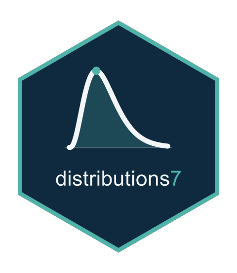

<!-- README.md is generated from README.Rmd. Please edit that file, then
     regenerate with devtools::build_readme(). Do not use knitr::knit(): it
     processes the code but leaves this YAML header in the output as literal
     text, which GitHub and pkgdown both render verbatim. -->
<!-- badges: start -->
[](https://github.com/statmodels7/distributions7/actions/workflows/R-CMD-check.yaml)
[](https://app.codecov.io/gh/statmodels7/distributions7)
[](https://lifecycle.r-lib.org/articles/stages.html#experimental)
<!-- badges: end -->

```{r, include = FALSE}
knitr::opts_chunk$set(
  collapse = TRUE,
  comment = "#>",
  fig.path = "man/figures/README-",
  out.width = "100%"
)
library(distributions7)
set.seed(1)
```

# distributions7 

Almost every R package that fits statistical models writes its own
distributions, privately: a `switch` on a character string, a list of closures
nothing outside can reach. The same Gamma is therefore re-implemented again
and again, each time only as far as that package happened to need it: the
density and the score, sometimes the Hessian, rarely anything beyond.

`{distributions7}` writes them once, as objects. Each carries the usual
density, distribution and quantile functions, together with the **exact
derivatives of the log-likelihood up to fourth order**. The derivatives are
available with respect to the parameters, with respect to the response, and
with respect to the unconstrained parameters behind a link function, which is
the scale an optimiser works on.

It is the distribution layer of [statmodels7](https://statmodels7.github.io),
an S7 toolkit for statistical modelling, and works alongside
[linkfunctions7](https://statmodels7.github.io/linkfunctions7/). The
mathematics behind every formula, from the likelihood theory and the change
of scale to the derivations for the zero-inflated, zero-adjusted, truncated
and transformed wrappers, is worked out in
[the statmodels7 book](https://statmodels7.github.io/book/).

## Installation

```{r eval=FALSE}
# install.packages("pak")
pak::pak("statmodels7/distributions7")
```

## The usual functions

Fourteen distributions ship with the package. Each constructor takes the link
functions used for its parameters, and parameters travel as a named list.

```{r}
d <- gaussian_distrib()
theta <- list(mu = 2, sigma = 3)

distrib_pdf(d, c(0, 2, 4), theta)
distrib_cdf(d, c(0, 2, 4), theta)
distrib_quantile(d, c(0.025, 0.5, 0.975), theta)
```

## Derivatives

The score, the observed and expected information, and the third and fourth
order derivatives are all closed form.

```{r}
y <- distrib_rng(d, 5, theta)

distrib_gradient(d, y, theta)
distrib_expected_hessian(d, 0, theta)
```

On the **link scale** the same generics return derivatives with respect to
the unconstrained parameters instead, computed through the chain rule rather
than by differentiating numerically:

```{r}
distrib_gradient(d, y, theta, scale = "link")
```

## Fitting

`fit_distrib()` maximises the likelihood on the link scale, where the
parameters are unconstrained, then reports estimates back on their natural
scale. Confidence intervals are built on the link scale and mapped through
$g^{-1}$, so they can never leave a parameter's domain.

```{r}
y <- distrib_rng(gamma_distrib(), 500, list(mu = 3, sigma2 = 2))
fit <- fit_distrib(gamma_distrib(), y)
fit
```

The fit knows what it was estimated from, so it can be checked against the data
and simulated from:

```{r fit-plot, fig.height = 4, fig.width = 6}
plot(fit)
```

```{r}
sims <- simulate(fit, 100, seed = 1)
quantile(vapply(sims, median, numeric(1)), c(0.025, 0.975))
```

The optimisation itself is delegated to
[optimizers7](https://statmodels7.github.io/optimizers7/), so `method` takes
any optimiser of that package as well as the three named strategies, and the
object brings its own stopping rule:

```{r}
fit2 <- fit_distrib(gamma_distrib(), y,
                    method = optimizers7::lbfgs(
                      criterion = optimizers7::crit_grad(1e-12)))
c(fisher = as.numeric(logLik(fit)), lbfgs = as.numeric(logLik(fit2)))
```

## A user-defined distribution needs only its density

Everything above has a numerical fallback registered on the base classes: the
distribution function by quadrature, the quantile function by root finding, the
generator by Generalized Ratio-of-Uniforms, and every derivative by finite
differences. So a new distribution is a subclass and one method.

```{r}
MyLaplace <- S7::new_class("MyLaplace", parent = continuous_distrib)

S7::method(distrib_pdf, MyLaplace) <- function(distrib, y, theta, log = FALSE) {
  ld <- -log(2 * theta$b) - abs(y - theta$mu) / theta$b
  if (log) ld else exp(ld)
}

d2 <- MyLaplace(
  distrib_name = "my laplace", dimension = "univariate", bounds = c(-Inf, Inf),
  params = c("mu", "b"), params_interpretation = c(mu = "location", b = "scale"),
  n_params = 2, params_bounds = list(mu = c(-Inf, Inf), b = c(0, Inf)),
  link_params = list(
    mu = linkfunctions7::identity_link(),
    b  = linkfunctions7::log_link()
  )
)

# never implemented, yet available
distrib_cdf(d2, 1, list(mu = 0, b = 2))
distrib_gradient(d2, 1, list(mu = 0, b = 2))
```

See `vignette("defining-a-distribution")` for the full treatment, including
what to do when a parameter is not differentiable.

## Validating a distribution

`check_distrib()` puts a distribution through thirteen numerical checks. It
verifies that the density integrates to one, that the distribution function
agrees with it, that the quantile function inverts it, and that the generator
follows it. It also checks every derivative order against finite differences,
on both scales.

```{r}
invisible(check_distrib(d2, list(mu = 0, b = 2), nsim = 2e4))
```

## What is in the box

| | |
|---|---|
| continuous | gaussian, cauchy, logistic, Student's t, Laplace, pseudo-Huber, gamma, inverse gaussian, lognormal, beta |
| discrete | bernoulli, binomial, poisson, negative binomial |
| multivariate | `mvgaussian_distrib()`, parametrised by a covariance or a precision structure from [covstructs7](https://statmodels7.github.io/covstructs7/) |
| wrappers | `zero_inflated()`, `zero_adjusted()`, `truncated()`, `fixed()`, `transformation()` with twelve transformers |
| tools | `fit_distrib()`, `check_distrib()`, `expectation()`, moments, `rng_grou()` |
