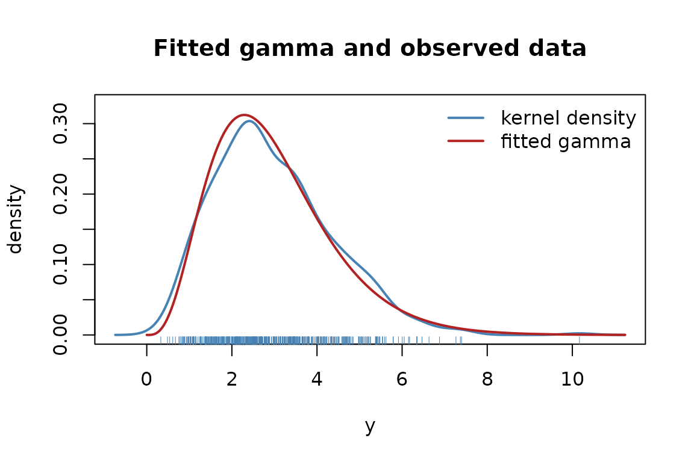
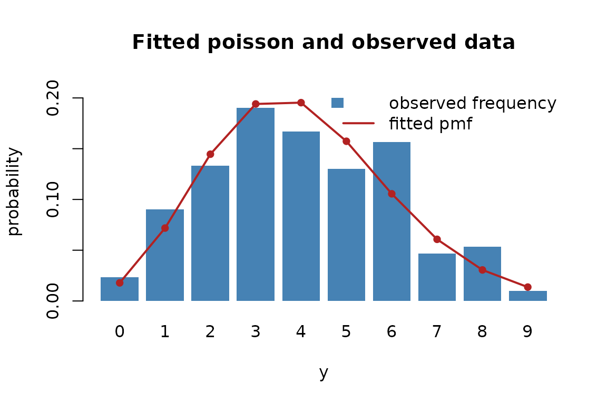

# Fitting a distribution to data

``` r

library(distributions7)
```

This vignette walks through fitting a distribution to a sample by
maximum likelihood, reading the result, checking it against the data,
and simulating from it. It assumes familiarity with distribution
objects;
[`vignette("defining-a-distribution")`](https://statmodels7.github.io/distributions7/articles/defining-a-distribution.md)
is the place to start otherwise.

## A first fit

Every distribution has a constructor. It takes the link functions for
its parameters, but the defaults are sensible, so most of the time it is
called with no arguments:

``` r

d <- gamma2_distrib()
d
#> Distribution: Gamma2
#> Type:         Continuous
#> Dimensions:   univariate
#> 
#> Parameters:
#>   mu     (mean)               | Link: log        | Domain: (0, Inf)
#>   sigma2 (variance)           | Link: log        | Domain: (0, Inf)
```

We simulate some data from a known parameter value and fit the
distribution back to it. Parameters travel as a named list.

``` r

y <- distrib_rng(d, 500, list(mu = 3, sigma2 = 2))
fit <- fit_distrib(d, y)
fit
#> Maximum-likelihood fit: gamma2
#> Observations: 500   Log-likelihood: -844   AIC: 1692   BIC: 1700
#> Method: Fisher scoring   iterations: 2   evaluations: f 3, g 3   time: 280 ms
#> Converged: yes (gradient (max-norm) < 1e-06 or |df| < 1e-12 (relative))
#> 
#> Parameter scale:
#>        Estimate Std. Error   2.5%  97.5%
#> mu       2.9706     0.0634 2.8488 3.0976
#> sigma2   2.0120     0.1498 1.7388 2.3281
#> 
#> Link scale:
#>        Estimate Std. Error   2.5%  97.5%
#> mu       1.0888     0.0214 1.0469 1.1306
#> sigma2   0.6991     0.0745 0.5532 0.8451
```

The estimates recover the values the sample was generated from, and the
print method shows them twice: on the **parameter scale**, and on the
**link scale** where the fitting actually happened. More on that split
below.

## Reading the fit

[`fit_distrib()`](https://statmodels7.github.io/distributions7/reference/fit_distrib.md)
returns an object that answers the familiar extractors:

``` r

coef(fit)
#>       mu   sigma2 
#> 2.970589 2.012010
vcov(fit)
#>                 mu      sigma2
#> mu     0.004024020 0.005451018
#> sigma2 0.005451018 0.022443720
logLik(fit)
#> 'log Lik.' -844.0323 (df=2)
confint(fit)
#>            2.5%    97.5%
#> mu     2.848824 3.097558
#> sigma2 1.738803 2.328143
```

[`coef()`](https://rdrr.io/r/stats/coef.html),
[`vcov()`](https://rdrr.io/r/stats/vcov.html) and
[`confint()`](https://rdrr.io/r/stats/confint.html) all take a `scale`
argument, which returns the same quantities on the unconstrained scale:

``` r

coef(fit, scale = "link")
#>        mu    sigma2 
#> 1.0887603 0.6991342
confint(fit, scale = "link")
#>             2.5%     97.5%
#> mu     1.0469064 1.1306142
#> sigma2 0.5531972 0.8450712
```

The interval on the link scale is symmetric about the estimate, and the
one on the parameter scale is its image under $`g^{-1}`$, which is why
the second is not symmetric.
[`confint()`](https://rdrr.io/r/stats/confint.html) also takes a
`level`, computed from the stored estimates and standard errors without
refitting:

``` r

confint(fit, level = 0.99)
#>            0.5%    99.5%
#> mu     2.811604 3.138565
#> sigma2 1.660868 2.437390
```

The object also carries the information criteria, the number of
iterations and the method that was actually used, all visible in the
print above.

## Why the link scale

A gamma’s mean and variance are positive; a beta’s probability lives in
$`(0, 1)`$; a Gaussian’s standard deviation is positive. Optimizing
those constrained parameters directly means fighting the boundary.
Instead
[`fit_distrib()`](https://statmodels7.github.io/distributions7/reference/fit_distrib.md)
optimizes the **unconstrained** parameters behind each link —
$`\log\mu`$ and $`\log\sigma^2`$ for the gamma — where there is no
boundary to hit, using the exact score and information the package
provides on that scale.

The estimates are then mapped back, and so are the intervals. Because a
confidence interval is built symmetrically on the link scale and pushed
through $`g^{-1}`$, its endpoints can never leave the parameter’s
domain:

``` r

b <- bernoulli_distrib()
fit_distrib(b, rbinom(40, 1, 0.9))
#> Maximum-likelihood fit: bernoulli
#> Observations: 40   Log-likelihood: -10.66   AIC: 23.31   BIC: 25
#> Method: Fisher scoring   iterations: 1   evaluations: f 2, g 2   time: 2 ms
#> Converged: yes (gradient (max-norm) < 1e-06 or |df| < 1e-12 (relative))
#> 
#> Parameter scale:
#>    Estimate Std. Error   2.5%  97.5%
#> mu    0.925     0.0416 0.7918 0.9756
#> 
#> Link scale:
#>    Estimate Std. Error   2.5%  97.5%
#> mu   2.5123     0.6003 1.3357 3.6889
```

Even with a probability estimate close to one and only forty
observations, the interval stays inside $`(0, 1)`$ — a symmetric
interval on the probability scale would have spilled past it.

## Choosing how it is optimized

The default is Fisher scoring, which uses the *expected* information.
Two other methods are available, and Fisher scoring and Newton fall back
to BFGS if they fail to converge:

``` r

fit_newton <- fit_distrib(d, y, method = "newton")
fit_bfgs   <- fit_distrib(d, y, method = "bfgs")

c(scoring = as.numeric(logLik(fit)),
  newton  = as.numeric(logLik(fit_newton)),
  bfgs    = as.numeric(logLik(fit_bfgs)))
#>   scoring    newton      bfgs 
#> -844.0323 -844.0323 -844.0323
```

They agree on the maximum. Fisher scoring is the default because it uses
the expected information, which stays well-behaved even where the
observed Hessian does not, and that matters for distributions with a
non-smooth parameter such as the Laplace.

The optimization runs through
[optimizers7](https://statmodels7.github.io/optimizers7/), and `method`
also accepts an optimizer object from that package, which is then used
as given. Choosing the optimizer this way also chooses its stopping
rule, its line search and its iteration budget:

``` r

library(optimizers7)

fit_lbfgs <- fit_distrib(d, y, method = lbfgs(criterion = crit_grad(1e-12)))
fit_nm    <- fit_distrib(d, y, method = nelder_mead(maxit = 5000))

c(lbfgs = as.numeric(logLik(fit_lbfgs)),
  nelder_mead = as.numeric(logLik(fit_nm)))
#>       lbfgs nelder_mead 
#>   -844.0323   -844.0323
c(fit_lbfgs@method, fit_nm@method)
#> [1] "L-BFGS"      "nelder-mead"
```

The three named strategies fall back to BFGS when they fail to converge;
an optimizer supplied explicitly is never replaced, so the method
reported is always the method that produced the estimates.

## Checking the fit against the data

A fit remembers the data it came from, so it can be drawn over it. For a
continuous distribution
[`plot()`](https://rdrr.io/r/graphics/plot.default.html) shows a kernel
density of the sample with the fitted density on top:

``` r

plot(fit)
```



For a discrete distribution it shows the observed frequencies as bars
with the fitted probability mass overlaid, because a kernel density
would misrepresent counts:

``` r

p <- poisson_distrib()
yp <- distrib_rng(p, 300, list(mu = 4))
plot(fit_distrib(p, yp))
```



## Simulating from the fit

[`simulate()`](https://rdrr.io/r/stats/simulate.html) draws new samples
from the fitted distribution. Each replicate has the same length as the
original data, which makes it a one-liner to build a parametric
bootstrap of any statistic:

``` r

sims <- simulate(fit, 200, seed = 1)
dim(sims)
#> [1] 500 200

boot_median <- vapply(sims, median, numeric(1))
quantile(boot_median, c(0.025, 0.975))
#>     2.5%    97.5% 
#> 2.597115 2.869105
```

It follows the
[`stats::simulate()`](https://rdrr.io/r/stats/simulate.html) contract: a
supplied `seed` makes the draw reproducible and is reported back on the
result, and the caller’s random stream is left untouched.

## Validating a distribution numerically

Before a fit is trusted, and especially before a user-written
distribution is,
[`check_distrib()`](https://statmodels7.github.io/distributions7/reference/check_distrib.md)
puts it through thirteen numerical checks. It confirms that the density
integrates to one, that the distribution function agrees with the
density, that the quantile inverts it, that the generator follows it,
and that every analytical derivative matches finite differences, on both
the parameter and the link scale:

``` r

invisible(check_distrib(d, list(mu = 3, sigma2 = 2)))
#> Distribution: gamma2
#> Parameters:   mu = 3, sigma2 = 2
#> Observations: 100   Monte Carlo: 200000
#> 
#>   [OK  ] density integrates to 1                     5.58e-10
#>   [OK  ] density is non-negative                     1.07e-02
#>   [OK  ] cdf in [0,1] and non-decreasing             2.46e-02
#>   [OK  ] cdf agrees with the density                 2.32e-11
#>   [OK  ] quantile/cdf round-trip                     5.55e-17
#>   [OK  ] rng matches the cdf                         1.17e+00
#>   [OK  ] gradient vs finite differences              6.49e-11
#>   [OK  ] hessian vs finite differences               5.78e-08
#>   [OK  ] deriv3 vs finite differences                1.75e-10
#>   [OK  ] deriv4 vs finite differences                6.98e-08
#>   [OK  ] expected information vs Monte Carlo         1.75e+00
#>   [OK  ] response derivatives vs finite differences  2.70e-08
#>   [OK  ] link-scale gradient vs finite differences   5.59e-08
#> 
#> All 13 checks passed.
```

Had a mistake crept into an analytical derivative, the corresponding
line would read `FAIL`, with the size of the discrepancy printed next to
it. It is the fastest way to catch a wrong formula.

## Further reading

- [`vignette("defining-a-distribution")`](https://statmodels7.github.io/distributions7/articles/defining-a-distribution.md)
  — defining a new distribution, which then works with everything shown
  here.
- [`?fit_distrib`](https://statmodels7.github.io/distributions7/reference/fit_distrib.md),
  [`?check_distrib`](https://statmodels7.github.io/distributions7/reference/check_distrib.md)
  — the full argument lists.
- [`?distrib_gradient`](https://statmodels7.github.io/distributions7/reference/distrib_gradient.md)
  — the derivatives, including what `scale = "link"` does.
