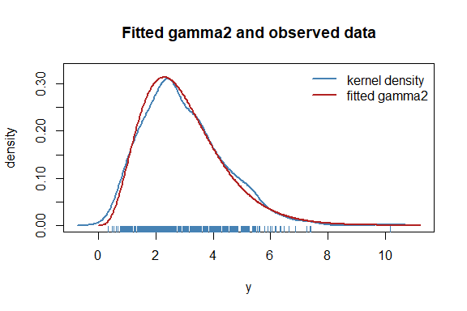
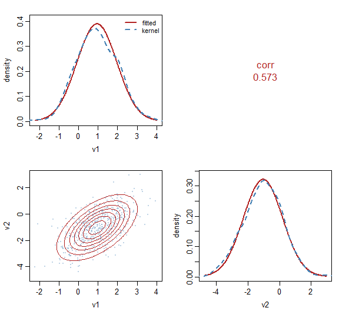

# distributions7

Almost every R package that fits statistical models writes its own
distributions, privately: a `switch` on a character string, a list of
closures nothing outside can reach. The same Gamma is therefore
re-implemented again and again, each time only as far as that package
happened to need it: the density and the score, sometimes the Hessian,
rarely anything beyond.

[distributions7](https://statmodels7.github.io/distributions7/) writes
them once, as objects. Each carries the usual density, distribution and
quantile functions, together with the **exact derivatives of the
log-likelihood up to fourth order**. The derivatives are available with
respect to the parameters, with respect to the response, and with
respect to the unconstrained parameters behind a link function, which is
the scale an optimizer works on.

It is the distribution layer of
[statmodels7](https://statmodels7.github.io), an S7 toolkit for
statistical modeling, and works alongside
[linkfunctions7](https://statmodels7.github.io/linkfunctions7/). The
mathematics behind every formula, from the likelihood theory and the
change of scale to the derivations for the zero-inflated, zero-adjusted,
truncated and transformed wrappers, is worked out in [the statmodels7
book](https://statmodels7.github.io/book/).

## Installation

``` r

# install.packages("pak")
pak::pak("statmodels7/distributions7")
```

Or the whole toolkit at once, which also installs the six sibling
packages:

``` r

pak::pak("statmodels7/statmodels7")
```

## The usual functions

The package carries 42 univariate distributions and 4 multivariate ones,
one name per parametrization where a family has several –
[`gaussian1_distrib()`](https://statmodels7.github.io/distributions7/reference/gaussian1_distrib.md)
in mean and scale,
[`gaussian2_distrib()`](https://statmodels7.github.io/distributions7/reference/gaussian2_distrib.md)
in mean and variance,
[`gaussian3_distrib()`](https://statmodels7.github.io/distributions7/reference/gaussian3_distrib.md)
in mean and precision, and likewise for 12 other families. Each
constructor takes the link functions used for its parameters, and
parameters travel as a named list.

``` r

d <- gaussian1_distrib()
theta <- list(mu = 2, sigma = 3)

distrib_pdf(d, c(0, 2, 4), theta)
#> [1] 0.1064827 0.1329808 0.1064827
distrib_cdf(d, c(0, 2, 4), theta)
#> [1] 0.2524925 0.5000000 0.7475075
distrib_quantile(d, c(0.025, 0.5, 0.975), theta)
#> [1] -3.879892  2.000000  7.879892
```

## Derivatives

The score, the observed and expected information, and the third and
fourth order derivatives are all closed form.

``` r

y <- distrib_rng(d, 5, theta)

distrib_gradient(d, y, theta)
#> $mu
#> [1] -0.20881794  0.06121444 -0.27854287  0.53176027  0.10983592
#> 
#> $sigma
#> [1] -0.2025185 -0.3220917 -0.1005749  0.5149736 -0.2971415
distrib_expected_hessian(d, 0, theta)
#> $mu_mu
#> [1] -0.1111111
#> 
#> $sigma_sigma
#> [1] -0.2222222
#> 
#> $mu_sigma
#> [1] 0
```

On the **link scale** the same generics return derivatives with respect
to the unconstrained parameters instead, computed through the chain rule
rather than by differentiating numerically:

``` r

distrib_gradient(d, y, theta, scale = "link")
#> $mu
#> [1] -0.20881794  0.06121444 -0.27854287  0.53176027  0.10983592
#> 
#> $sigma
#> [1] -0.6075556 -0.9662751 -0.3017248  1.5449208 -0.8914246
```

## Fitting

[`fit_distrib()`](https://statmodels7.github.io/distributions7/reference/fit_distrib.md)
maximizes the likelihood on the link scale, where the parameters are
unconstrained, then reports estimates back on their natural scale.
Confidence intervals are built on the link scale and mapped through
$`g^{-1}`$, so they can never leave a parameter’s domain.

``` r

y <- distrib_rng(gamma2_distrib(), 500, list(mu = 3, sigma2 = 2))
fit <- fit_distrib(gamma2_distrib(), y)
fit
#> Maximum-likelihood fit: gamma2
#> Observations: 500   Log-likelihood: -841.2   AIC: 1686   BIC: 1695
#> Method: Fisher scoring   iterations: 17   evaluations: f 18, g 18   time: 30 ms
#> Converged: yes (gradient (max-norm) < 1e-06 or |df| < 1e-12 (relative))
#> 
#> Parameter scale:
#>        Estimate Std. Error   2.5%  97.5%
#> mu       2.9570     0.0631 2.8359 3.0832
#> sigma2   1.9888     0.1480 1.7188 2.3011
#> 
#> Link scale:
#>        Estimate Std. Error   2.5%  97.5%
#> mu       1.0842     0.0213 1.0424 1.1260
#> sigma2   0.6875     0.0744 0.5416 0.8334
```

The fit carries the data it was estimated from, so it can be checked
against the data and simulated from:

``` r

plot(fit)
```



``` r

sims <- simulate(fit, 100, seed = 1)
quantile(vapply(sims, median, numeric(1)), c(0.025, 0.975))
#>     2.5%    97.5% 
#> 2.570081 2.881259
```

The optimization itself is delegated to
[optimizers7](https://statmodels7.github.io/optimizers7/). One argument
says how to optimize, and it takes either an optimizer of that package,
which brings its own stopping rule, or
[`fisher_scoring()`](https://statmodels7.github.io/distributions7/reference/fisher_scoring.md),
which is Newton’s method with the expected information and carries how
that information is to be obtained when the family has no closed form
for it.

``` r

fit2 <- fit_distrib(gamma2_distrib(), y,
                    method = optimizers7::lbfgs(
                      criterion = optimizers7::crit_grad(1e-12)))
c(fisher = as.numeric(logLik(fit)), lbfgs = as.numeric(logLik(fit2)))
#>    fisher     lbfgs 
#> -841.2326 -841.2326
```

Where a fit starts matters more than it looks, so a family is asked for
its own starting value through
[`distrib_start()`](https://statmodels7.github.io/distributions7/reference/distrib_start.md).
A family with a known estimator returns it and the fit begins there; one
that says nothing gets random draws.

``` r

d4 <- mvgaussian_distrib(4)
y4 <- as.matrix(iris[, 1:4])
f4 <- fit_distrib(d4, y4)
c(iterations = f4@iterations, converged = f4@converged)
#> iterations  converged 
#>          1          1
```

## Several dimensions

A multivariate distribution carries a mean vector and a matrix, and the
matrix comes from a structure of
[parameters7](https://statmodels7.github.io/parameters7/). Its free
values are scalars, so the parameter vector is a named list of numbers
exactly as above and every generic here applies unchanged,
[`fit_distrib()`](https://statmodels7.github.io/distributions7/reference/fit_distrib.md)
included. The names say which matrix the structure describes, `sigma_`
for a covariance and `omega_` for a precision, because the same
structure on the two sides is two different models.

``` r

dm <- mvgaussian_distrib(2)
dm@params
#> [1] "mu1"          "mu2"          "sigma_log_L1" "sigma_log_L2" "sigma_L2.1"

ym <- distrib_rng(dm, 500, list(mu1 = 1, mu2 = -1, sigma_log_L1 = 0, sigma_log_L2 = 0,
                                sigma_L2.1 = 0.7))
fitm <- fit_distrib(dm, ym)
mv_sigma(dm, coef(fitm))
#>           v1        v2
#> v1 1.0476959 0.7273189
#> v2 0.7273189 1.5380692
```

Those free values are coordinates an optimizer moves in, not quantities
anybody reads, and they are not what the fit prints.
[`mv_summary()`](https://statmodels7.github.io/distributions7/reference/mv_summary.md)
carries the fit’s variance matrix onto the ones that are, by the delta
method, and builds each interval on the scale that keeps it in its own
set: a standard deviation on the log scale, a correlation on Fisher’s
*z*. A precision parametrization reports the same standard deviations
and correlations — they are properties of the law — and adds the
conditional variances and partial correlations, which are what it
describes directly.

``` r

mv_summary(fitm)
#>            Estimate Std. Error      2.5%     97.5%
#> sd_v1     1.0235702 0.03236813 0.9620558 1.0890178
#> sd_v2     1.2401892 0.03921823 1.1656565 1.3194875
#> cor_v1_v2 0.5729534 0.03004043 0.5111287 0.6288798
```

Up to three coordinates the fit can be drawn, each panel showing a
marginal: the fitted density against a kernel estimate on the diagonal,
and contours against the observations below it.

``` r

plot(fitm)
```



[`mvstudent_t_distrib()`](https://statmodels7.github.io/distributions7/reference/mvstudent_t_distrib.md)
is the heavy-tailed alternative, with the degrees of freedom estimated
alongside everything else. Its
[`mv_sigma()`](https://statmodels7.github.io/distributions7/reference/mv_sigma.md)
is the **scale** matrix and its
[`variance()`](https://statmodels7.github.io/distributions7/reference/variance.md)
the covariance, which differ by $`\nu/(\nu-2)`$ and which the family
keeps apart so that it remains usable below two degrees of freedom,
where the covariance does not exist.

Two families are not elliptical.
[`dirichlet_distrib()`](https://statmodels7.github.io/distributions7/reference/dirichlet_distrib.md)
lives on the simplex, written in a mean vector — a `parameters7` simplex
— and a concentration, and its marginals are beta with that same
concentration.
[`multinomial_distrib()`](https://statmodels7.github.io/distributions7/reference/multinomial_distrib.md)
is discrete, and being discrete it can enumerate its support:
[`mv_support()`](https://statmodels7.github.io/distributions7/reference/mv_support.md)
returns every vector of counts summing to the size, so its normalization
and its expected information are exact sums rather than samples.

``` r

dm <- multinomial_distrib(3, size = 5)
th <- list(probs_alr1 = 0.3, probs_alr2 = -0.2)
sum(distrib_pdf(dm, mv_support(dm, th), th))
#> [1] 1
```

## A user-defined distribution needs only its density

Everything above has a numerical fallback registered on the base
classes: the distribution function by quadrature, the quantile function
by root finding, the generator by Generalized Ratio-of-Uniforms, and
every derivative by finite differences. So a new distribution is a
subclass and one method.

``` r

MyLaplace <- S7::new_class("MyLaplace", parent = continuous_distrib)

S7::method(distrib_pdf, MyLaplace) <- function(distrib, y, theta, log = FALSE) {
  ld <- -log(2 * theta$b) - abs(y - theta$mu) / theta$b
  if (log) ld else exp(ld)
}

d2 <- MyLaplace(
  distrib_name = "my laplace", dimension = "univariate", bounds = c(-Inf, Inf),
  params = c("mu", "b"), params_interpretation = c(mu = "location", b = "scale"),
  n_params = 2, params_bounds = list(mu = c(-Inf, Inf), b = c(0, Inf)),
  link_params = list(
    mu = linkfunctions7::identity_link(),
    b  = linkfunctions7::log_link()
  )
)

# never implemented, yet available
distrib_cdf(d2, 1, list(mu = 0, b = 2))
#> [1] 0.6967347
distrib_gradient(d2, 1, list(mu = 0, b = 2))
#> $mu
#> [1] 0.5
#> 
#> $b
#> [1] -0.25
```

See
[`vignette("defining-a-distribution")`](https://statmodels7.github.io/distributions7/articles/defining-a-distribution.md)
for the full treatment, including what to do when a parameter is not
differentiable.

## Validating a distribution

[`check_distrib()`](https://statmodels7.github.io/distributions7/reference/check_distrib.md)
puts a distribution through thirteen numerical checks. It verifies that
the density integrates to one, that the distribution function agrees
with it, that the quantile function inverts it, and that the generator
follows it. It also checks every derivative order against finite
differences, on both scales.

``` r

invisible(check_distrib(d2, list(mu = 0, b = 2), nsim = 2e4))
#> Distribution: my laplace
#> Parameters:   mu = 0, b = 2
#> Observations: 100   Monte Carlo: 20000
#> 
#>   [OK  ] density integrates to 1                     1.81e-10
#>   [OK  ] density is non-negative                     5.00e-03
#>   [OK  ] cdf in [0,1] and non-decreasing             2.46e-02
#>   [OK  ] cdf agrees with the density                 6.25e-07
#>   [OK  ] quantile/cdf round-trip                     3.31e-10
#>   [OK  ] rng matches the cdf                         1.68e+00
#>   [OK  ] gradient vs finite differences              0.00e+00
#>   [OK  ] hessian vs finite differences               0.00e+00
#>   [OK  ] deriv3 vs finite differences                0.00e+00
#>   [OK  ] deriv4 vs finite differences                0.00e+00
#>   [OK  ] expected information vs Monte Carlo         2.30e+00
#>   [OK  ] response derivatives vs finite differences  0.00e+00
#>   [OK  ] link-scale gradient vs finite differences   3.24e-09
#> 
#> All 13 checks passed.
```

## What is in the box

|  |  |
|----|----|
| continuous | gaussian, cauchy, logistic, Student’s t, Laplace, pseudo-Huber, skew normal, skew t, gamma, generalized gamma, inverse gaussian, lognormal, exponential, chi-squared, Weibull, Gumbel, generalized Pareto, beta, von Mises |
| discrete | bernoulli, binomial, beta-binomial, poisson, geometric, negative binomial in both the quadratic and the linear variance parametrization |
| multivariate | [`mvgaussian_distrib()`](https://statmodels7.github.io/distributions7/reference/mvgaussian_distrib.md), parametrized by a covariance or a precision structure from [parameters7](https://statmodels7.github.io/parameters7/); [`mvstudent_t_distrib()`](https://statmodels7.github.io/distributions7/reference/mvstudent_t_distrib.md), which keeps its scale matrix and its covariance apart so that it is usable where the second moment does not exist; [`dirichlet_distrib()`](https://statmodels7.github.io/distributions7/reference/dirichlet_distrib.md) on the simplex, whose marginals are beta; and [`multinomial_distrib()`](https://statmodels7.github.io/distributions7/reference/multinomial_distrib.md), whose support is enumerated by [`mv_support()`](https://statmodels7.github.io/distributions7/reference/mv_support.md) so that every expectation is an exact sum |
| wrappers | [`zero_inflated()`](https://statmodels7.github.io/distributions7/reference/zero_inflated.md), [`zero_adjusted()`](https://statmodels7.github.io/distributions7/reference/zero_adjusted.md), [`truncated()`](https://statmodels7.github.io/distributions7/reference/truncated.md), [`folded()`](https://statmodels7.github.io/distributions7/reference/folded.md), [`fixed()`](https://statmodels7.github.io/distributions7/reference/fixed.md), [`transformation()`](https://statmodels7.github.io/distributions7/reference/transformation.md) with twelve transformers |
| tools | [`fit_distrib()`](https://statmodels7.github.io/distributions7/reference/fit_distrib.md), [`check_distrib()`](https://statmodels7.github.io/distributions7/reference/check_distrib.md), [`expectation()`](https://statmodels7.github.io/distributions7/reference/expectation.md), moments, [`rng_grou()`](https://statmodels7.github.io/distributions7/reference/rng_grou.md) |
